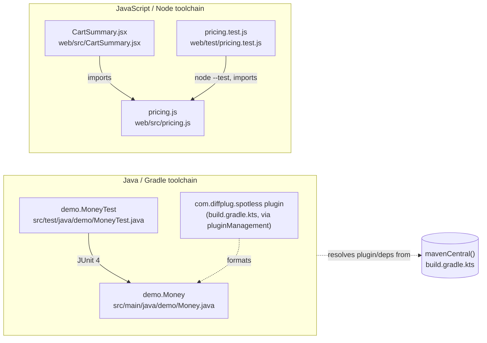

There is no runtime integration between the two halves of this repo — they don't call each
other over HTTP, share a process, or share a database. The only relationship is the source
import inside the JS half.

Notes:

- `Money.java` and `pricing.js` are structurally parallel (both do cent-arithmetic) but are
  never invoked from one another — there's no RPC, shared package, or codegen bridging them.
- `CartSummary.jsx` is the only file that imports `pricing.js`; it's not itself under test
  (no JSX/render test exists) — see `web/src/CartSummary.jsx:5-8` comment for why.
- `build.gradle.kts` resolves the `spotless` plugin through `pluginManagement`/`mavenCentral()`
  rather than a core Gradle plugin, specifically to exercise real dependency resolution
  (network/registry loopback) — see `README.md` for why that's load-bearing.
