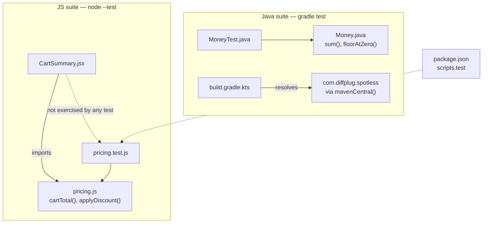

The two toolchains are independent — neither imports from nor invokes the
other. They are joined only conceptually (both compute cart/cent money math).

Notes:
- `CartSummary.jsx` is the only consumer of `pricing.js` at runtime, but no
  test renders it — the fixture only exercises the pure helper functions.
- `pricing.js` deliberately has zero imports (see `gotchas.md`), so the JS
  subgraph above has no edge into `node_modules`/React at test time even
  though `package.json` lists `react`/`react-dom` as dependencies.
