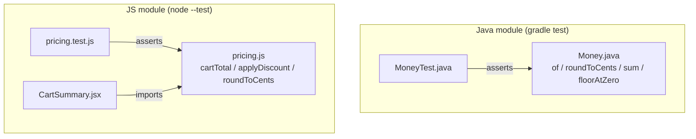

There is deliberately no edge between the two subgraphs. No file in the repo
opens a socket, calls `fetch`, or defines a server/`main` entrypoint (verified
by search — no matches for `fetch`/`http`/server bootstrap outside
`package-lock.json`). `Money.java` and `pricing.js` are two standalone
implementations of similar cent-arithmetic concepts; they are not the same
service split across languages, and a change to one has no runtime effect on
the other.

Both sides now implement the same half-up cents-rounding rule
(`Money#roundToCents` on the Java side, `roundToCents` in `pricing.js` on the
JS side — ties round away from zero, e.g. `-0.005` -> `-0.01`) as a
deliberate cross-language parity contract documented in README.md's
"Rounding" section. This is still not a runtime link — there is no shared
code or import between the two — the implementations are just meant to stay
in lockstep by convention. On the Java side, `Money` must be built via
`Money.of(String)` or `Money.of(double)` (which goes through
`BigDecimal.valueOf`), never `new BigDecimal(double)`, or parity with the JS
side breaks. `CartSummary.jsx` renders `pricing.js`'s output (including the
new `roundToCents` call) but is not itself exercised by any test — the pure
functions are what's under test.
