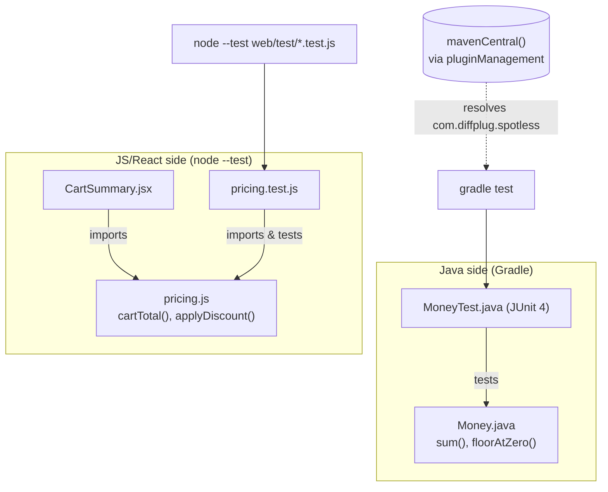

## Notes on the wiring

- **The two sides do not call each other.** There is no HTTP/IPC/shared build
  between `src/` (Java) and `web/` (JS). They are two separate toolchains
  living in one repo, verified independently.
- **`CartSummary.jsx` is a dead end for testing purposes**: it imports
  `pricing.js`, but nothing imports or renders `CartSummary.jsx` itself, and
  no test touches it. It exists to make `web/` a genuine React app rather
  than to be exercised.
- **`pricing.js` imports nothing** (not even React) — this is intentional per
  its own file comment, so `node --test` can never fail for install/dependency
  reasons.
- **Gradle plugin resolution is the interesting edge**: `com.diffplug.spotless`
  is a third-party plugin declared in `plugins {}` in build.gradle.kts, backed
  by `mavenCentral()` in the `repositories {}` block — this is the one point
  in the repo that talks to a package registry.
