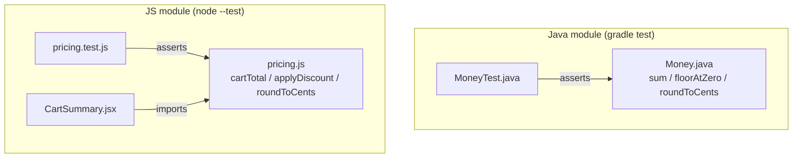

There is deliberately no edge between the two subgraphs. No file in the repo
opens a socket, calls `fetch`, or defines a server/`main` entrypoint (verified
by search — no matches for `fetch`/`http`/server bootstrap outside
`package-lock.json`). `Money.java` and `pricing.js` are two standalone
implementations of similar cent-arithmetic concepts; they are not the same
service split across languages, and a change to one has no runtime effect on
the other. `CartSummary.jsx` renders `pricing.js`'s output but is not itself
exercised by any test — the pure functions are what's under test.

`Money.java` and `pricing.js` each now also implement `roundToCents`, a
HALF_UP round-to-two-decimals rule (README.md "Rounding" section). This is
parallel implementation, not shared code — there's still no runtime link —
but both are expected to agree bit-for-bit on the same input, and both suites
assert identical fixtures (`1.005 -> 1.01`, `2.344 -> 2.34`, `-1.005 -> -1.01`)
to keep them honest. `roundToCents` on both sides takes a dollar-scale amount,
not cents: `CartSummary.jsx` must divide `cartTotal(lines)` by 100 before
calling it (a prior version rounded the raw cent total and was fixed in
PT-2283).
