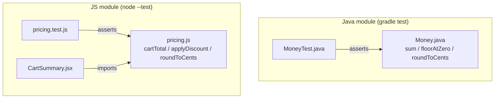

There is deliberately no edge between the two subgraphs. No file in the repo
opens a socket, calls `fetch`, or defines a server/`main` entrypoint (verified
by search — no matches for `fetch`/`http`/server bootstrap outside
`package-lock.json`). `Money.java` and `pricing.js` are two standalone
implementations of similar cent-arithmetic concepts; they are not the same
service split across languages, and a change to one has no runtime effect on
the other. `CartSummary.jsx` renders `pricing.js`'s output but is not itself
exercised by any test — the pure functions are what's under test.

Both modules now also carry a `roundToCents` helper (`Money.roundToCents()`
in Java, `roundToCents(amount)` in `pricing.js`) implementing the same
half-up rounding rule, per README.md's "Rounding" section. These are two
independently-written, mirrored implementations kept in sync by convention
(each doc-comments the other) — not shared code, and still no runtime link
between the modules.
