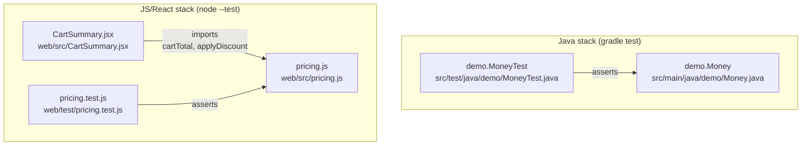

The two subgraphs above are the entire picture: there is no edge between
them. Nothing in `web/` makes an HTTP call into the Java code, and nothing in
`build.gradle.kts` builds or serves `web/`. They are co-located only — a
newcomer used to full-stack repos should not assume `CartSummary.jsx` talks
to a Java backend.

`pricing.js` deliberately imports nothing (see the file header comment), so
the JS suite can never fail for install/dependency reasons — that property is
part of why the fixture works (see `../../README.md`).
